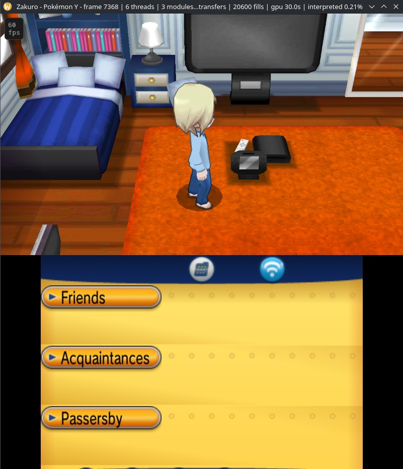
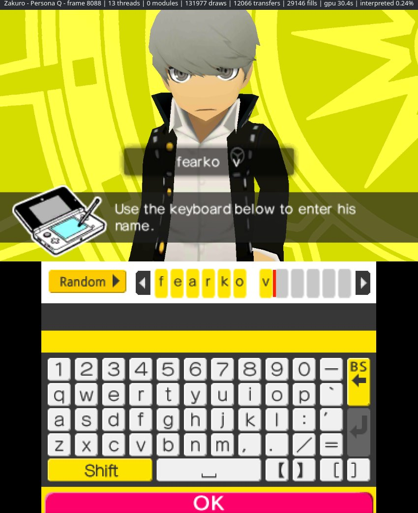

# Zakuro

A WIP HLE Nintendo 3DS emulator written in Rust that uses ahead-of-time (AOT) recompilation instead of a JIT.

Bug reports, progress and everything else are on the [Discord server](https://discord.gg/7dduXVv2xm).

The games tested so far are in [COMPATIBILITY.md](COMPATIBILITY.md).

  
  
  

I started developing this project in October 2025, before
[feargba](https://github.com/fearkov/feargba). 

I first wrote it in C++, but I was learning Rust at the time and noticed there wasn't a working 3DS emulator written in Rust, so I switched.

This is a personal experimental project. You can use it to play games, but that was never the main goal. Some games boot. Instead of translating code while the game runs, like a JIT does, Zakuro runs code recompiled ahead of time by [3dsrecomp](https://github.com/fearkov/3dsrecomp), and tested games run at full speed that way. On the interpreter alone they run below full speed.

Builds for Windows and Linux are on the [releases page](https://github.com/fearkov/zakuro/releases): on Windows, unzip it and run zakuro.exe, and on Linux, extract it and run ./zakuro.

To build it yourself you need Rust 1.95 or newer. On Linux, building also needs pkg-config and the ALSA and udev development files (libasound2-dev and libudev-dev on Debian and Ubuntu, alsa-lib and systemd-libs on Arch). On Windows, nothing else is needed:

    cargo install --git https://github.com/fearkov/zakuro --locked zakuro

Cargo puts it in ~/.cargo/bin, which has to be on your PATH. Then `zakuro` in a terminal opens it. To play you need a decrypted ROM:

    zakuro path/to/rom.3ds

Without a ROM it opens a library with the games in a folder you pick, where you can also recompile them. Esc brings up a menu over the game, and the settings (controls, sound, graphics, a background for the library) are in there too.

Games run faster with their code recompiled ahead of time by [3dsrecomp](https://github.com/fearkov/3dsrecomp), which comes with Zakuro: press Recompile next to a game in the library, once per game. It takes around ten minutes and needs a C compiler. If your computer has gcc or clang, Zakuro uses it, and if it has neither, Zakuro offers to download Zig, which comes with one and needs no installing, into its own folder. From then on Zakuro runs the recompiled code on its own, and anything it doesn't cover still goes through the interpreter.

3dsrecomp also works on its own, from the terminal:

    cargo install --git https://github.com/fearkov/3dsrecomp --locked recomp3ds
    3dsrecomp build path/to/rom.3ds

--recompiled points it at another library, and --interpreter runs everything in the interpreter.

You can use mods too. I kept the same folders Luma3DS and Azahar use, so if a mod works there, it should work here as it is. Each game has its own folder, `mods/<title ID>/`, inside Zakuro's data folder (`~/.local/share/zakuro/mods/` on Linux, `%APPDATA%\zakuro\mods\` on Windows), and the Mods button next to the game in the library opens it for you:

- `romfs/` is for files that replace the game's own, or add new ones.
- `romfs_ext/` is for .ips and .bps patches to the game's files, and .stub files to remove one.
- `code.bin`, `code.ips` or `code.bps`, in the folder or in `exefs/`, change the game's code.
- `exheader.bin`, in the game's folder, replaces the game's exheader, which code mods that make the game's code longer come with.
- `textures/` is for texture packs made for Citra or Azahar. Put in it what the pack puts in `load/textures/<title ID>/`, its pack.json and its folders of PNGs.

If your mod changes the game's code, recompile the game with the mod already in its folder, and everything keeps running at full speed. Otherwise the parts the mod touches go through the interpreter and run slower, and if you recompiled the game before 0.2.19, the whole game goes through it until you recompile it again.

Texture packs need "Draw the 3D on the GPU", which is on by default. Their pictures load in the background, so the first time something shows up you may see the game's own texture for a moment. Only PNGs are read for now, which is what almost every pack uses.

Got updates or DLC for a game? Just drop them in the same folder as your games and Zakuro figures out which game they belong to, and uses them when you play it. They need to be decrypted, same as the games. If you have more than one update for the same game, it picks the newest. And if you recompiled the game before adding its update, recompile it again, or the parts the update changed will run slower.

Cheats work too, the same files Citra and Azahar use, so if you already have them there, just copy them over to the cheats folder in Zakuro's data folder. You can also turn them on and off, or paste a new one, from the Cheats button in the menu while you're playing.

For some games, the Cheats window also has a 60 FPS switch. It's a code someone from the community made (their name is right there), and I only list it for the exact version of the game I tested it on, so it might not show up for your copy. One thing to know: most of these games count time in frames, so with 60 FPS on, the whole game runs twice as fast too. Great for grinding in Pokémon, maybe less so for everything else.

No copyrighted data is included. I do not condone piracy, and I will not help you with that. So, don't ask me about that.

Controls:

| 3DS | Keyboard | Controller |
|---|---|---|
| A / B / X / Y | X / Z / S / A | Right / bottom / top / left face buttons |
| L / R | Q / W | LB / RB (L1 / R1) |
| Start / Select | Enter / Backspace | Start / Back (Select) |
| D-pad | Arrow keys | D-pad |
| Circle pad | I / J / K / L | Left stick |
| Touch screen | Mouse (click) | |
| Menu / Pause / Fullscreen | Esc / F1 / F11 | Home |

Keys and controller buttons can be changed in the settings. Xbox, PlayStation, Switch Pro and most other controllers work.

Contributions are welcome. Using AI is fine sometimes, but the code must always be reviewed by a human. Code that is entirely vibecoded will be discarded.

MIT license.
